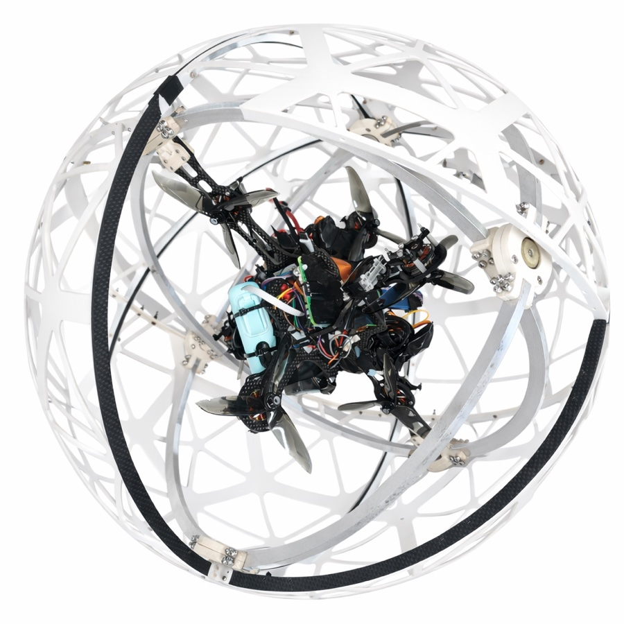
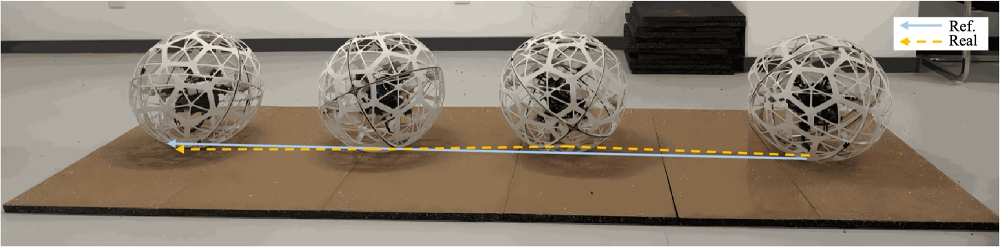
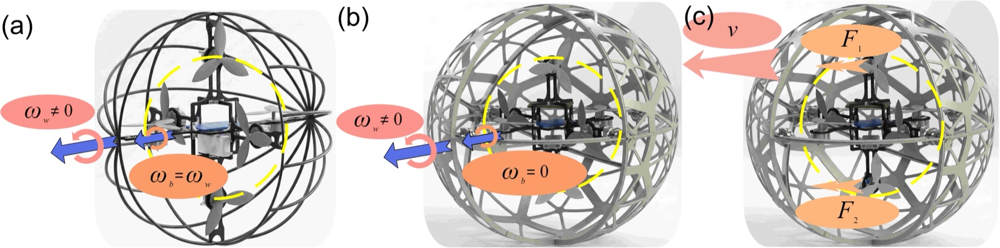
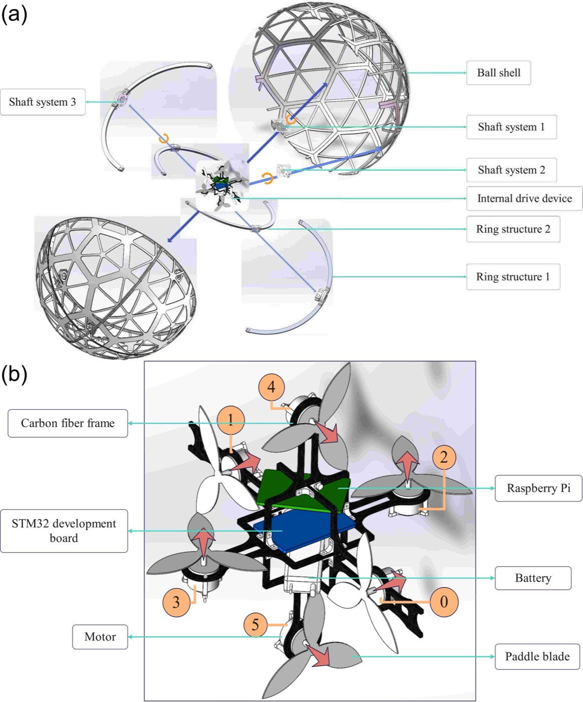
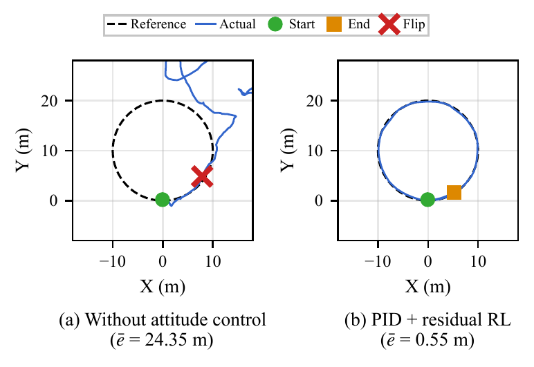
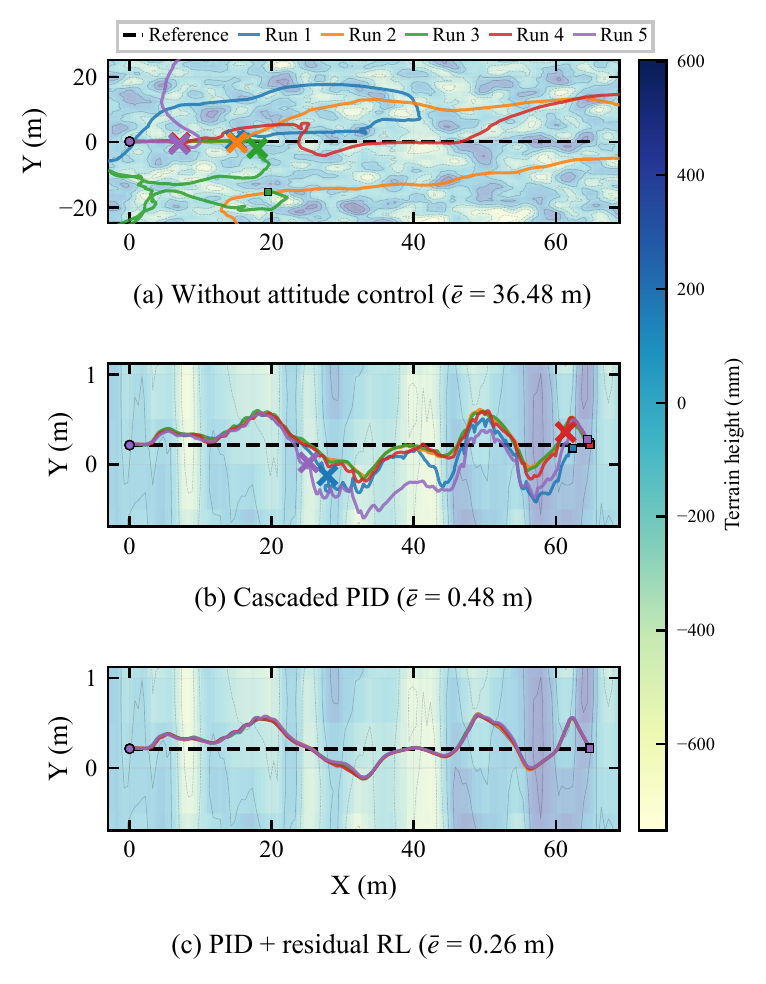
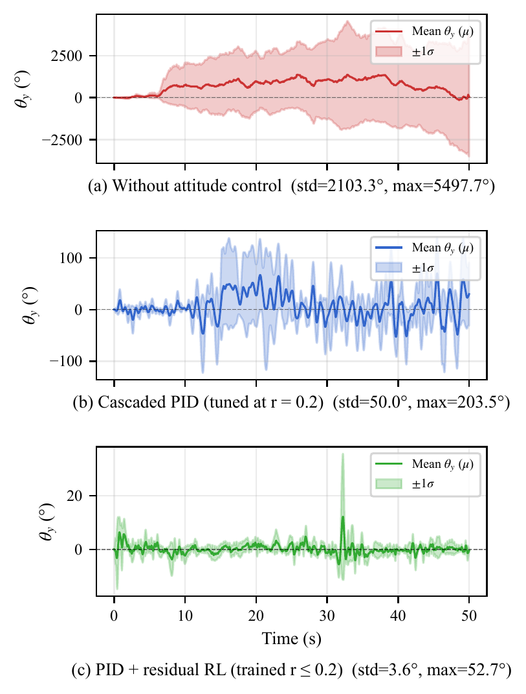
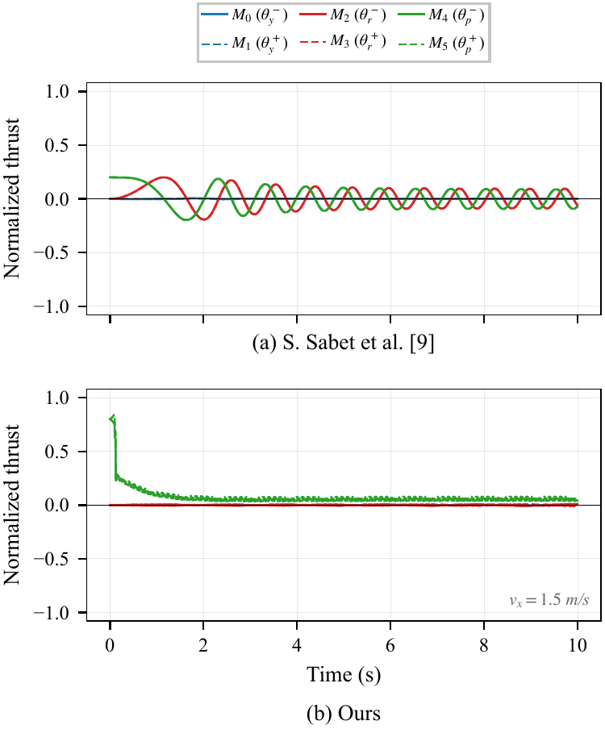
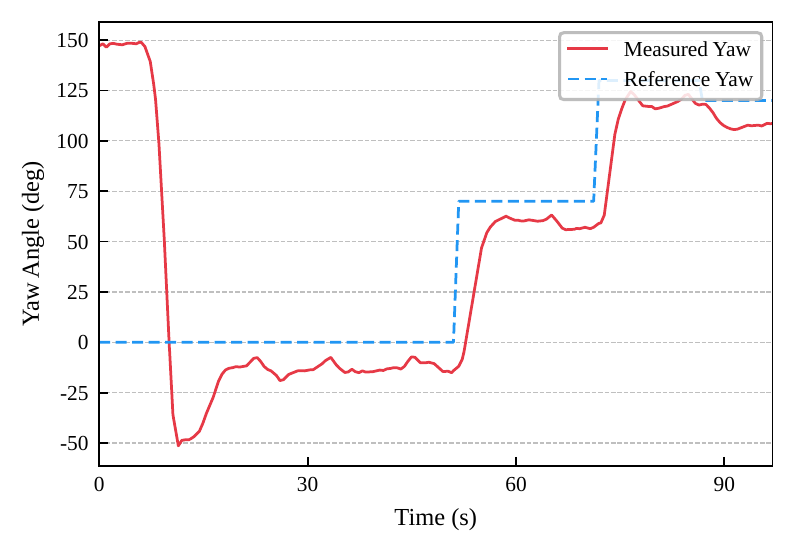

<div align="center">

**English** | [简体中文](README.zh-CN.md)

# D6SR: A Mechanically Decoupled Six-Axis Spherical Rolling Robot

**Design and Control of D6SR: A Mechanically Decoupled Six-Axis Spherical Rolling Robot for Stable Propeller-Driven Rolling**<br>
IROS 2026

Leqi Ding\*, Xijian Deng\*, Jiayi Chen, Jin Yang, Ping Wei<br>
Xi'an Jiaotong University · \*equal contribution

Paper: coming soon · [License: Apache-2.0](LICENSE)



</div>

D6SR is a propeller-driven spherical robot. Six reversible propellers are mounted on an inner body, and a three-DoF gimbal decouples that body from the passive rolling shell. While the shell rolls, the inner body stays level, so every thrust direction stays fixed in the world frame and the motors do not have to keep reversing. A cascaded PID controller holds the inner-body attitude. On top of it, a residual reinforcement-learning policy, trained in simulation on IMU-only observations, adds corrective torque on rough terrain.

<p align="center">
  <br>
  <em>Hardware rolling experiment: the robot keeps a straight heading (blue: reference, yellow: actual).</em>
</p>

## Contents

- [Highlights](#highlights)
- [Hardware](#hardware)
- [Method](#method)
- [Results](#results)
- [Repository structure](#repository-structure)
- [Getting started](#getting-started)
- [Reproducing the paper](#reproducing-the-paper)
- [Serial protocol](#serial-protocol)
- [Citation](#citation)
- [License](#license)

## Highlights

- **Mechanical decoupling.** A three-DoF gimbal separates shell rotation from the propulsion module, so thrust directions stay constant during rolling.
- **Tri-orthogonal six-propeller propulsion.** Three orthogonal pairs of reversible propellers can generate an arbitrary body wrench without dedicated drive motors.
- **Cascaded PID + residual RL.** A Soft Actor-Critic policy outputs only a residual torque on top of the PID baseline.
- **Calibrated simulation.** The MuJoCo model is calibrated to the prototype (per-propeller thrust, bearing friction, sensor noise, loop delay, thrust lag). The repository includes the trained policy and the scripts that regenerate every simulation figure in the paper.

## Hardware

<p align="center">
  <br>
  <em>(a) Without decoupling the inner body rotates with the shell. (b) With the gimbal it stays still while the shell rolls. (c) Thrusts F<sub>1</sub>, F<sub>2</sub> therefore stay fixed in the world frame and drive the robot at velocity v.</em>
</p>

| Item | Specification |
|---|---|
| Outer diameter / total mass | 460 mm / 2.78 kg |
| Propulsion | 6 reversible brushless motors with bidirectional ESCs, 14.7 N max thrust each |
| Controller | STM32F407VET6 (libopencm3 + FreeRTOS), cascaded PID at 100 Hz |
| Companion computer | Raspberry Pi 4B (serial bridge, logging, MQTT) |
| Attitude sensor | IMU over UART, 200 Hz |
| Link | UART 115200 bps, 8N1 |

<details>
<summary>Mechanical design</summary>
<p align="center">
  <br>
  <em>(a) Exploded view of the outer shell and the gimbal-based inner module. (b) Integrated six-actuator propulsion and control platform.</em>
</p>
</details>

## Method

**Attitude control.** Roll, pitch and yaw of the inner body are regulated by three cascaded PID loops: the outer loop maps angle to angular-rate setpoint, the inner loop maps rate to torque. The firmware (`stm32/cascaded_pid.c`) and the simulator (`simulation/mujoco_sim/control/cascaded_pid.py`) implement the same controller.

**Motion control.** The desired planar acceleration is rotated from the world frame into the body frame using the measured yaw, then tracked by a velocity PID.

**Control allocation.** Motors M0/M1, M2/M3 and M4/M5 form the yaw, roll and pitch pairs. The commanded wrench is mapped to signed, normalized motor thrusts and clipped to [-1, 1]. In the code and on the robot, the attitude torque of each pair is applied by raising the thrust of one motor only, rather than pushing the two motors in opposite directions. This engineering choice avoids reversing the motors just to make small attitude corrections.

**Residual RL.** The policy adds a bounded residual torque to the PID output. Each observation frame is 11-dimensional (sin/cos of roll, pitch and yaw; body rates; velocity-tracking error), and the policy input stacks the last four frames. It was trained with SAC for 400k steps, with domain randomization over gimbal initial angles, rolling friction, target velocity and terrain roughness (≤ 0.2). Full hyperparameters are in [docs/figure_reproduction.md](docs/figure_reproduction.md).

## Results

All simulation figures below come from the scripts in this repository with the released policy. PID gains were tuned, and the policy was trained, only on terrain roughness ≤ 0.2.

| Task | No attitude control | Cascaded PID | PID + residual RL |
|---|---|---|---|
| Circle, R = 10 m, 0.5 m/s, roughness 0.2 | flips, mean error 24.35 m | — | **0.55 m, no flip** |
| Straight line, 1.0 m/s, roughness 0.3: flips in 5 runs | 5 / 5 | 3 / 5 | **0 / 5** |

<table>
  <tr>
    <td align="center" width="50%"><br><em>Circular rolling on roughness 0.2.</em></td>
    <td align="center" width="50%"><br><em>Straight-line rolling on roughness 0.3, five runs per controller. × marks a flip.</em></td>
  </tr>
  <tr>
    <td align="center"><br><em>Inner-body yaw on roughness 0.3 (mean ± 1σ over 4 runs).</em></td>
    <td align="center"><br><em>Motor commands at v<sub>x</sub> = 1.5 m/s: (a) shell-fixed propellers (Rollocopter, Sabet et al.) keep reallocating thrust; (b) D6SR holds nearly constant thrust.</em></td>
  </tr>
</table>

<p align="center">
  <br>
  <em>Hardware: yaw stabilization during rolling under step reference commands.</em>
</p>

## Repository structure

```
D6SR/
├── stm32/                     # STM32F407 firmware: FreeRTOS tasks, cascaded PID, PWM, IMU, UART
├── raspberry_pi/              # host program: serial bridge, MQTT, logging and plotting
├── simulation/
│   ├── mujoco_sim/
│   │   ├── simulation.py      # RobotSimulation: model build, contact, rolling friction, IMU
│   │   ├── config/            # robot_params.yaml, calibrated plant, tuned PID gains
│   │   ├── control/           # cascaded PID, allocation, baseline controller, trajectories
│   │   ├── rl/                # Gym-style env, SAC, residual training; released policy in rl/checkpoints/
│   │   ├── analysis/          # scripts for paper Figs. 5-7 and PID tuning
│   │   ├── benchmark_*.py     # benchmark scripts (benchmark_baseline.py -> Fig. 8)
│   │   └── video/             # scenario recording
│   ├── robot_v0/, robot_v1/   # URDF + meshes (v0: shell-fixed baseline, v1: D6SR)
├── docs/                      # figure_reproduction.md, figures
├── data/                      # hardware yaw data behind Fig. 9
├── tools/                     # yaw PID tuning and figure-data utilities
├── libopencm3/                # submodule
└── rtos/FreeRTOS-Kernel/      # submodule
```

## Getting started

### Simulation

Python ≥ 3.9:

```bash
git clone --recursive https://github.com/CybDing/D6SR.git
cd D6SR/simulation/mujoco_sim
pip install mujoco numpy scipy matplotlib pyyaml torch

# baseline attitude stabilization + velocity drive (headless, with plots)
python control/run_baseline.py --plot --drive-x 0.5
```

Run every script from `simulation/mujoco_sim/`. On macOS, the interactive viewer needs `mjpython` (e.g. `mjpython control/run_baseline.py --no-headless`). Physics parameters live in `config/robot_params.yaml`; after editing them, regenerate the MJCF with `python robot_loader.py`.

### Firmware

Requirements: `arm-none-eabi-gcc` ≥ 10, `make`, `st-flash` (stlink-tools).

```bash
git submodule update --init --recursive    # if not cloned with --recursive
make -C libopencm3 TARGETS=stm32/f4         # once

cd stm32
make                 # build
make f407-program    # clean rebuild + flash
make monitor         # serial console (minicom, /dev/ttyUSB0, 115200)
```

Pin, timer and UART assignments are in `stm32/pin_config.h`.

### Host (Raspberry Pi)

```bash
cd raspberry_pi
pip3 install -r requirements.txt
python3 main.py          # serial + MQTT + logging + plotting
python3 simple_test.py   # connectivity check
```

## Reproducing the paper

Run from `simulation/mujoco_sim/` with `P=rl/checkpoints/calib_v7b_nojoint_fs4/best.pt`:

| Figure | Command |
|---|---|
| Fig. 5 circle | `python analysis/fig_circle.py --policy $P` |
| Fig. 6 terrain | `python analysis/fig6_ablation.py --policy $P` |
| Fig. 7 yaw | `python analysis/fig_paper_yaw.py --policy $P` |
| Fig. 8 allocation | `python benchmark_baseline.py --no-rl` |

Seeds are fixed, so the reruns reproduce the published numbers exactly. [docs/figure_reproduction.md](docs/figure_reproduction.md) (in Chinese) lists the expected values for each figure, the PID-tuning and RL-training commands, a table mapping the paper's hyperparameters to code arguments, and the places where the implementation differs from the paper's wording. Fig. 9 is a hardware experiment; its data, recovered from the vector figure, is in `data/fig9_yaw_hardware.csv`.

## Serial protocol

Frames are `CMD:DATA1,DATA2,...\n` over UART at 115200 bps, 8N1.

| Command | Format | Direction | Meaning |
|---|---|---|---|
| `PWM` | `PWM:m0,m1,m2,m3,m4,m5` | Pi → STM32 | set the six motor pulses, 1000–2000 µs, 1500 = neutral |
| `PID` | `PID:kp,ki,kd` | Pi → STM32 | update PID gains |
| `IMU` | `IMU` → `IMU:ax,ay,az,gx,gy,gz,roll,pitch,yaw` | both | request / return IMU data |
| `STATUS` | `STATUS` → `STATUS:motor,imu,pid` | both | subsystem status |
| `DEBUG` | `DEBUG:message` | STM32 → Pi | debug message |

## Citation

```bibtex
@inproceedings{ding2026d6sr,
  title     = {Design and Control of {D6SR}: A Mechanically Decoupled Six-Axis Spherical Rolling Robot for Stable Propeller-Driven Rolling},
  author    = {Ding, Leqi and Deng, Xijian and Chen, Jiayi and Yang, Jin and Wei, Ping},
  booktitle = {2026 IEEE/RSJ International Conference on Intelligent Robots and Systems (IROS)},
  year      = {2026}
}
```

## License

The code in this repository is released under the [Apache License 2.0](LICENSE). The third-party submodules keep their own licenses: `libopencm3/` (LGPL-3.0) and `rtos/FreeRTOS-Kernel/` (MIT).
